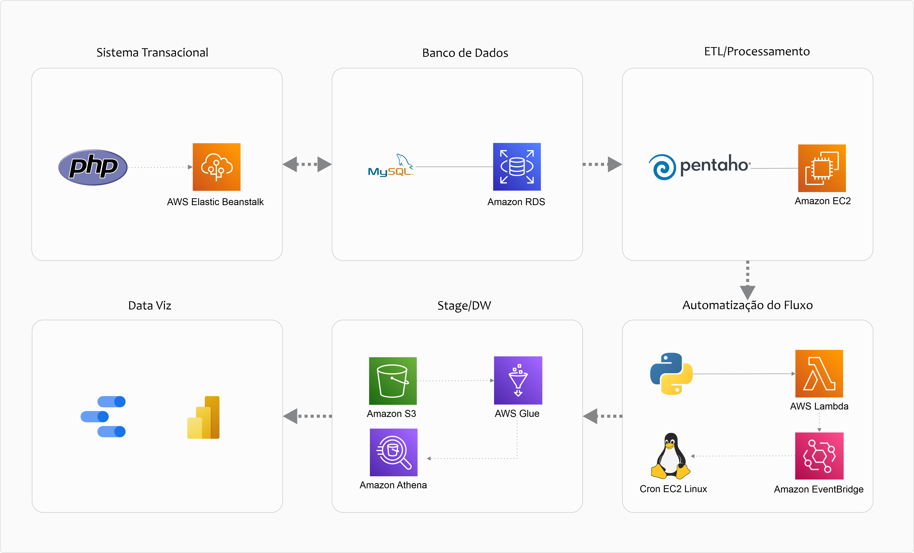

  <h1>Integração das ferramentas Pentaho Data Integration e Amazon Web Services</h1>

  

  

_________________

### Sobre
A solução cria um fluxo automatizado de extração, tratamento e carga de dados integrando as ferramentas Pentaho Data Integration e Amazon Web Services.

Resumo: Fonte de Dados > ETL > Automatização do ETL e do Start/Stop do servidor > Consumo dos dados.

### Tecnologias
*	PHP
*	MySQL
*	Pentaho Data Integration
*	Python
*	Linux
*	AWS Elastic Beanstalk
*	Amazon RDS
*	Amazon EC2
*	AWS Lambda
*	Amazon EventBridge
*	Amazon S3
*	AWS Glue
*	Amazon Athena

### Etapas:
*	Deploy da aplicação web com Elastic Beanstalk. A aplicação utilizada está disponível no repositório <a href="https://github.com/viniciusariza/agenda-z">agenda-z</a>; 
*	Integração da aplicação web com banco de dados no RDS;
*	Conexão da fonte de dados no RDS através do PDI instalado em uma instância EC2 Linux, tratamento dos dados e carga de dados para um Bucket S3;
*	Automatização do fluxo de atualizações executando o spoon periodicamente na instância EC2 através do cron;
*	Criação de função Lambda para Start/Stop da instância EC2 apenas nas janelas de atualizações.
*	Crawler do Bucket S3 com o Glue e conexão com o Athena;
*	Integração do Athena com ferramenta de Data Viz utilizando conector JDBC.

Scripts utilizados: <a href="https://github.com/viniciusariza/aws-pentaho/blob/main/scripts_fluxo.sh">scripts-fluxo.sh</a>
